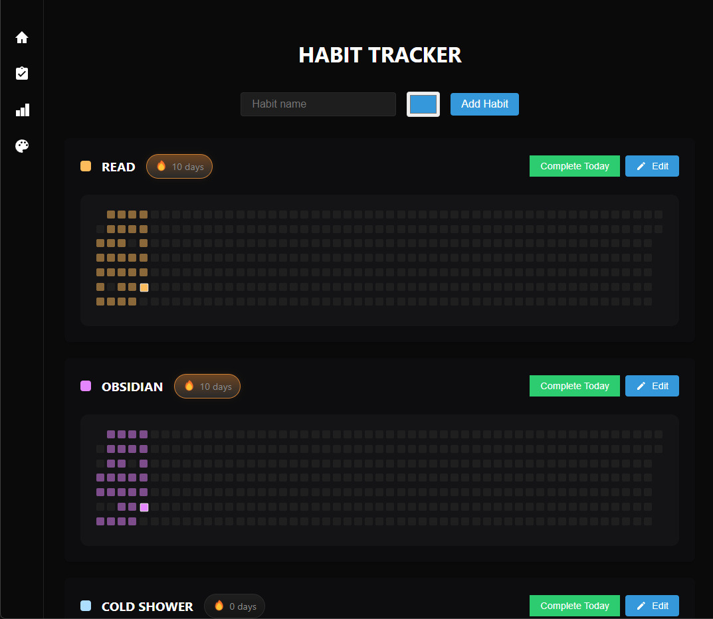
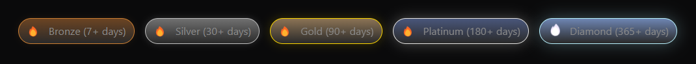
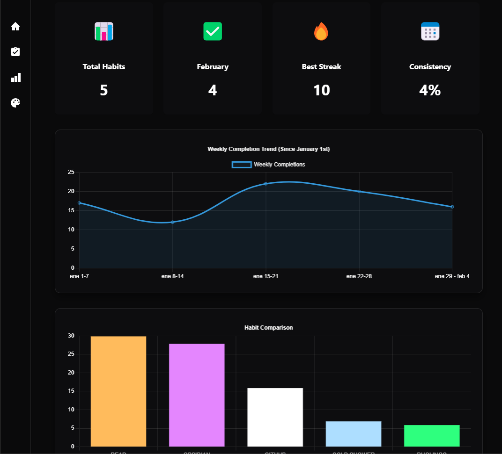
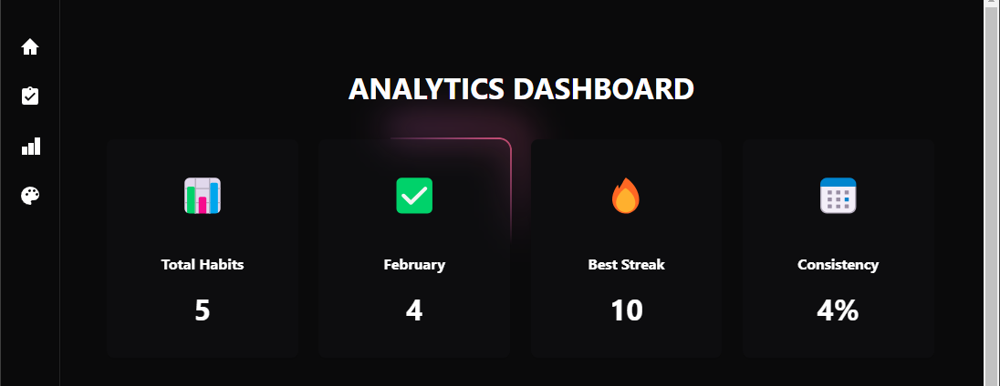
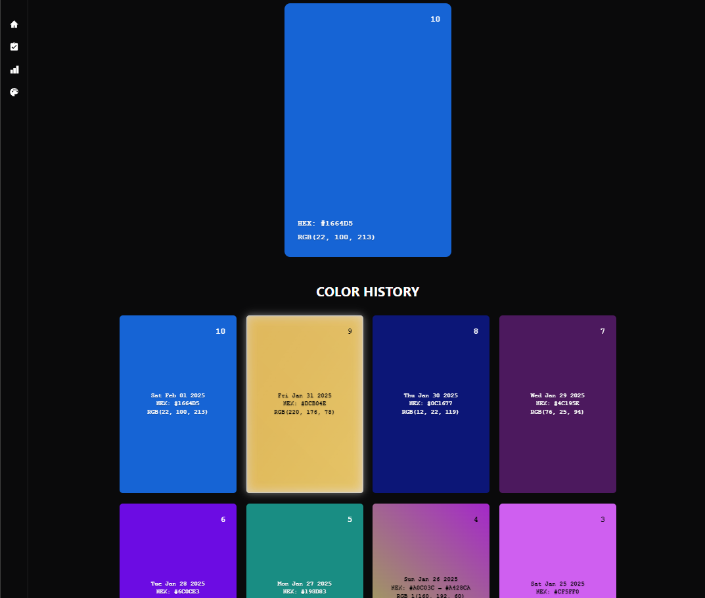

# 📱 Habit Tracker Desktop Application

A desktop application built with Electron.

## ✨ Features

- Manage user habits: Add, delete, and mark habits as complete.
- Streak tracking: Visual feedback on progress with streak animations.
- Analytics: Visual analytics for habits using Chart.js.
- Daily colors: Generate and display daily colors with special effects.
- 3D card effects: Dynamic 3D effects for color cards.

## 🚀 Getting Started

### Installation

1. Clone this repository
2. Install dependencies:
```sh
npm install
```

### Development

To run the application in development mode:
```sh
npm start
```

### Building

To create a new version:

1. Update the version in `package.json`:
```json
{
  "version": "1.1.0"
}
```

2. Build the application:
```sh
npm run package
npm run make
```

## 🔧 Requirements

- Node.js 14.x or higher
- npm 6.x or higher

## 🏗️ Core Components

### 📋 Habit Tracker
The Habit Tracker component is responsible for managing user habits. It allows users to add new habits, delete existing ones, and mark habits as complete for the day. The component also calculates streaks and displays them, providing visual feedback on the user's progress.



**✨ Effects Used:**
- Streak animations: The streak animations provide visual feedback on the user's progress. Different streak levels (bronze, silver, gold, platinum, diamond) are represented with unique animations and colors. The streak count is displayed with a flame icon that animates based on the streak level.

**🔥 Streak Levels:**
- Bronze: 7+ days
- Silver: 30+ days
- Gold: 90+ days
- Platinum: 180+ days
- Diamond: 365+ days



### 📊 Analytics
The Analytics component provides visual analytics for the habits. It includes features such as weekly trends and habit comparisons. Users can see their total habits, completion rates for the current month, best streaks, and consistency percentages. The component uses Chart.js to render interactive charts.



**✨ Effects Used:**
- Glowing borders: The cards in the Analytics component have glowing borders that react to the cursor. When the user hovers over a card, the border glows and follows the cursor, creating a dynamic and engaging visual effect.

**Glowing Borders Preview:**



### 🎨 Color Component
The Color Component generates and displays daily colors. It includes special effects like holographic and gem patterns. The component saves the daily color to local storage and maintains a history of past colors. 



**3D Card Effect:**
The Color Component features a 3D card effect that enhances the visual appeal of the color cards. When the user moves the mouse over a card, the card tilts in response to the cursor's position, creating a dynamic 3D effect. This effect is achieved using CSS transforms and JavaScript event listeners to track the mouse movement.

**🌟 Card Effects and Chances:**
- **Standard:** A single solid color card
- **Holographic (3.5%):** A card with a holographic effect
- **Gradient (6.5%):** A card with a gradient transition
- **Gem (1%):** A card with a gem pattern using Delaunay triangulation
- **Web (1%):** A card with a web pattern using Voronoi cells
- **Chinese Character (1%):** A card with a Chinese character and its translation

It also provides a preview section to showcase different types of color cards, including normal, holographic, gradient, gem, web, and Chinese character cards.


## 📄 License

MIT License
